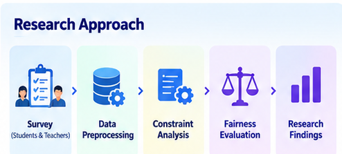
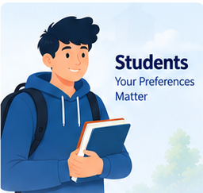
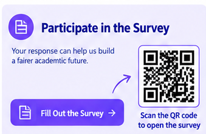

# ⚖️ Fairness-Aware AI Routine Generator

  
  
  
  

  <strong>Exploring Fair, Personalized & Intelligent University Routine Generation</strong>

  A research study exploring how Artificial Intelligence can support fair and effective
  university academic scheduling by considering students, teachers, courses, resources,
  workload, and scheduling constraints.

---

## 📋 Participate in Our Research

  

  

  <strong>📱 Scan the QR code to open the survey</strong>

---

## 🧠 About the Research

**Fairness-Aware AI Routine Generator** is a research project focused on exploring how Artificial Intelligence can be used to support university academic routine generation.

University scheduling is more than assigning courses to available time slots. A practical routine must consider the different and sometimes conflicting needs of students, teachers, courses, laboratories, rooms, resources, workload, and time.

The research therefore asks:

> **How can AI generate university routines that are not only feasible and personalized, but also fair?**

---

## 🎯 Research Objectives

The research aims to:

1. Investigate student preferences for academic routines.
2. Investigate teacher requirements and teaching preferences.
3. Identify academic, laboratory, resource, and scheduling constraints.
4. Explore fairness strategies for AI-based scheduling decisions.
5. Study how AI can balance satisfaction, efficiency, and fairness.
6. Establish a foundation for future AI-powered routine-generation software.

---

## 🔬 Research Approach

  

The current phase focuses on **research and data collection**.

The general research flow is:

**Survey → Data Analysis → Constraint Identification → Fairness Investigation → Research Findings**

The findings can then guide the design of the future software system.

---

## 👥 Who Can Participate?

<table>
<tr>
<td width="50%" align="center">

### 🎓 Students

The research investigates student preferences related to class timing, workload, breaks, practical labs, campus transitions, assessments, and routine structure.

</td>
<td width="50%" align="center">

### 👨‍🏫 Teachers

The research investigates teaching workload, preferred teaching slots, research time, consultation periods, breaks, course scheduling, and resource requirements.

</td>
</tr>
</table>

---

## 📚 Key Research Areas

The research brings together:

- 🎓 Student scheduling
- 👨‍🏫 Faculty workload
- 📚 Course and laboratory scheduling
- 🏫 Resource constraints
- ⚖️ Fairness in AI decisions
- 🔄 Multi-semester fairness

---

## ⚖️ Fairness in AI Scheduling

A central issue in academic scheduling is what happens when everyone's preferred option cannot be satisfied.

For example, an AI system may need to choose between:

- Maximizing the number of satisfied people
- Distributing inconvenient slots fairly
- Considering workload differences
- Considering previous scheduling burdens
- Prioritizing important resource constraints

The research explores how students and teachers believe such decisions should be made.

---

## 🧪 Course, Laboratory & Resource Constraints

Academic scheduling involves multiple real-world constraints.

These include:

- Course and section availability
- Theory and practical classes
- Laboratory duration and workload
- Room availability
- Laboratory availability
- Faculty availability
- Assessment and examination conflicts
- Time-slot limitations

A future AI system can use these constraints to generate feasible candidate routines before applying fairness-based evaluation.

---

## 📊 Expected Research Impact

The research is intended to provide a foundation for:

- More balanced academic routines
- Better understanding of scheduling preferences
- More transparent AI scheduling decisions
- Fairer distribution of scheduling burdens
- Better resource-aware scheduling
- Future AI-based routine generation

---

## 🔄 Multi-Semester Fairness

Fairness can extend beyond a single semester.

A future scheduling system could consider historical scheduling burden so that the same group does not repeatedly receive inconvenient schedules.

This creates the possibility of **long-term fairness** rather than evaluating every routine independently.

---

## 💻 Future Software Development

The current work is **research-focused**.

Based on the research findings, we plan to develop a future software system capable of generating university routines automatically.

### Possible Future Features

- 🎓 Student preference management
- 👨‍🏫 Teacher preference management
- 📚 Course management
- 🧪 Laboratory scheduling
- 🏫 Room and resource management
- ⏰ Time-slot management
- ⚖️ Fairness-aware conflict resolution
- 📊 Routine quality and fairness analysis
- 🔄 Historical fairness tracking
- 🗓️ Automatic routine generation
- 📤 Routine export and sharing

> **The software is planned future work and is not presented as a completed outcome of the current research.**

---

## 📝 Take Part in the Survey

Your response can help us understand how students and teachers believe an AI-based university routine generator should make scheduling decisions.

  

### 🔗 Survey Link

**Google Form:**  
https://forms.gle/59XJjqLhhGUA8yAPA

### 📱 QR Code

---

## 🚀 Future Research & Development

- [ ] Collect survey responses
- [ ] Clean and organize research data
- [ ] Analyze student preferences
- [ ] Analyze teacher preferences
- [ ] Identify major scheduling constraints
- [ ] Define appropriate fairness criteria
- [ ] Develop fairness metrics
- [ ] Convert preferences into structured parameters
- [ ] Develop a scheduling/optimization model
- [ ] Generate candidate routines
- [ ] Evaluate routine fairness
- [ ] Develop AI-based routine-generation software
- [ ] Build a web-based interface
- [ ] Test with real-world university scheduling data
- [ ] Compare against conventional scheduling approaches

---

## 🔗 Project Links

| Resource | Link |
|---|---|
| 📦 GitHub Repository | [Fairness-Aware-AI-Routine](https://github.com/JamshedSifat/Fairness-Aware-AI-Routine) |
| 📝 Research Survey | [Google Form](https://forms.gle/59XJjqLhhGUA8yAPA) |
